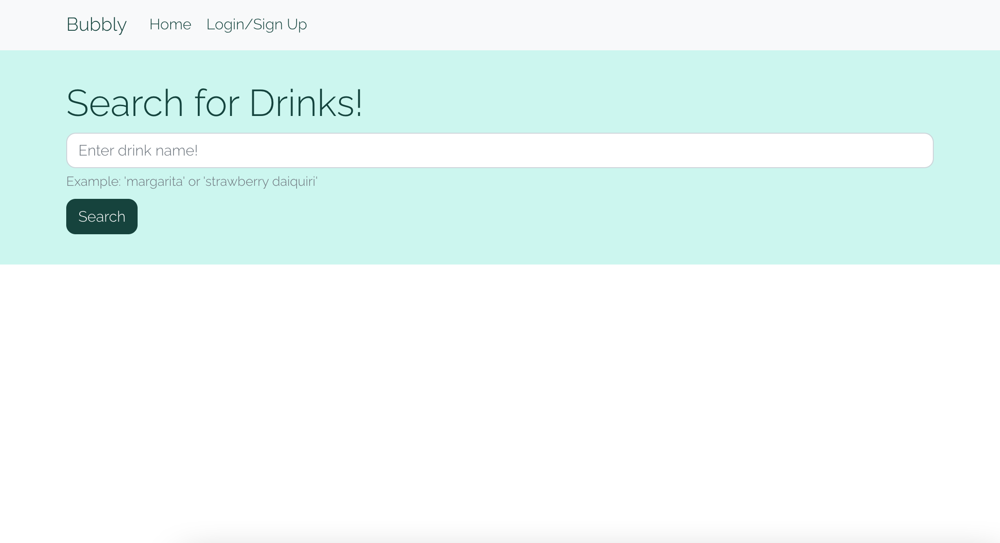
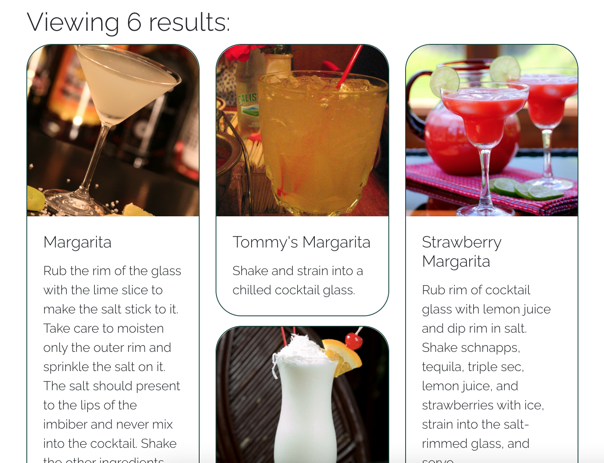
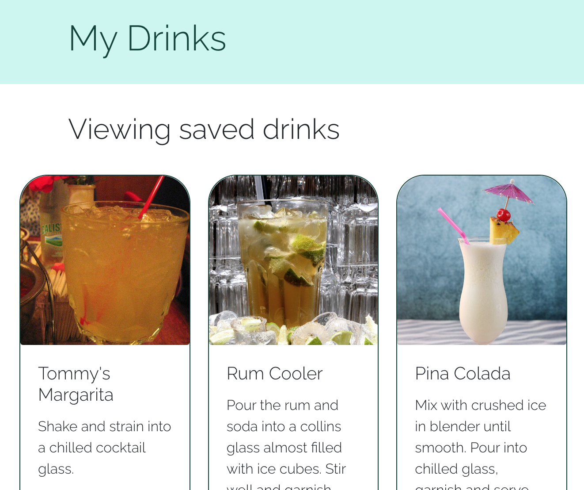

# Bubbly

## Functionality
Bubbly is your go-to search engine for all sorts of cocktails! Upon entering the site, the user is shown a search bar and a navigation bar. Drinks can be searched whether or not the user is logged in. If the user is logged in they have the ability to save drinks to their dashboard.

## Technologies Used
React for front-end

GraphQL and Node.js

MongoDB and Mongoose ODM

Apollo

bcrypt

JSON Web Token (JWT)

Bootstrap

## Preview
### Landing Page

### Drink Results

### Saved Page

## Links
GitHub Repo:

https://github.com/randronaco1027/booze-and-bubbles

Heroku: 

https://desolate-cove-27377.herokuapp.com/
